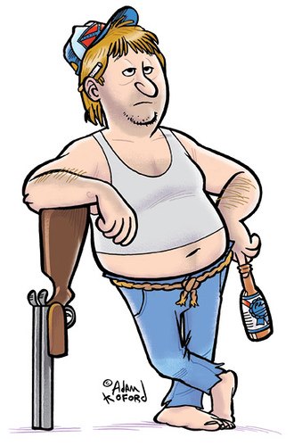

#E.A.R.L. 
> The External Asset and Resource Linker Plugin for Statamic

__UPDATED!!!__ E.A.R.L. has undergone a full rewrite with new features:

- Define groups more easily `{{ earl:mygroup }}` 
- Allow unlimited attributes on genenerated tags

<div class="clearfix">&nbsp;</div>

Howdy y'all. Muh name's Earl. I do one thang an' one thang only: I help yuh link to external whirlygigs and thingamabobs from yer Statamic site. Have files on a CDN or some such nonsense that you need to link to? That's why yuh got me. I'll help yuh drop in simple tags that point to where you need. Sounds downright handy don't it? Well, that's cause it is.

But since I'm such a nice guy, I'll go the extra mile for yuh. I'll even let you define specific paths and file extensions you can use on demand. No more havin' to remember that really long URL some other knucklehead stores assets in everytime you want to link to a file. 

I know yer interested. Keep on readin' down to learn how to use it.

<div class="clearfix">&nbsp;</div>

##Installation
1. [Download](https://github.com/raygesualdo/statamic-earl/archive/master.zip) or clone the plugin archive.
2. Copy `_add-ons/earl` to `_add-ons/earl`
3. Copy `_config/add-ons/earl` to `_config/add-ons/earl`

##Use
Drop the `{{ earl:method }}` tag anywhere you want, where `method` is the config group E.A.R.L. will pull from.

###Parameters
 - __src__: Path to the file (defaults to theme name)
 - __tag__: Determines if a tag should be included in output ([Tag Values Matrix](#tagvaluesmatrix))
 - __attr__: Attributes to be added to corresponding tag, e.g. `{{ earl:img attr="class:thumbnail|alt:This is the alt text" }}`

###Tag Values Matrix 
<a id="tagvaluesmatrix"></a>
Value | Output | Notes
----- | ------ | -----
`js`<br>`script`<br>`scripts`<br>`javascript` | `<script src=""></script>` |
`css`<br>`style`<br>`styles`<br>`stylesheet` | `<link href="" rel="stylesheet">` |
`img`<br>`image`<br>`images` | `` |
`true` | `<script src=""></script>` or<br>`<link href="" rel="stylesheet">` or <br>`` | This tag is for backwards compatibility with theme style helpers. Passing `true` will automatically assign the `js`, `css` or `img` methods to their corresponding tag output e.g. `{{ earl:js src="script.js" tag="true" }}` outputs `<script src="BASEPATH/GROUPPATH/script.js"></script>`.

##Config
The config file has two sections: general settings and config groups. The general settings section currently consists of only the `_earl_base` variable. This is where you can set the base URL for all links that E.A.R.L. builds. The base URL should begin with 'http', 'https' or '//'. If none of those strings are present (i.e. a bare URL), '//' will be prepended to the URL.

The config group section is where E.A.R.L. shines. Config groups allow you to set two different variables, one relating to the path and one relating to the extension. Let's take a look at the default settings for the __JS__ group as an example:

```yaml
_earl_path_js: 'path/to/js/files'
_earl_ext_js: '.js'
```

Notice how both variables end with `_js`. This determines the _config group_ to which this variable belongs. You can leverage this to create config groups of your own and use them via the method you use.

I'll show you how this works. Assume you wanted to create a config group for some mp3 files. We would begin by adding the following variables to the config file:

```yaml
_earl_path_audio: 'really/long/path/to/buried/audio/files'
_earl_ext_audio: '.mp3'
```

Next, we could use these settings by dropping in `{{ earl:audio src="track01" }}`. The resulting URL would be `EARLBASEPATH/really/long/path/to/buried/audio/files/track01.mp3`.

__NOTE__: Unless the extension of the files within a group will always stay the same (this may be the case e.g. javascript files), do not add an entry for the groups `ext` variable. Instead, include the extension in the `src` path.

##API
Coming soon!

<hr>

Many thanks to [Adam Koford](http://www.adamkoford.com/) for graciously allowing me to use his art for the Earl character.
